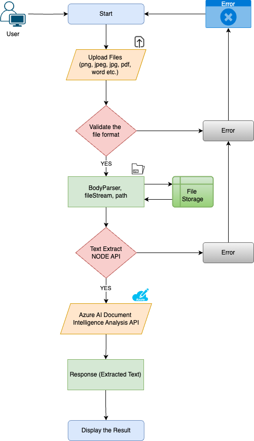

# Final Project: Integrated Text Extraction with Azure AI Document Intelligence

## Project Details

### URL to Live API
[Live API](http://104.131.75.28:3000/)

### Document Intelligence Text Extraction

This project utilizes Azure AI Document Intelligence to extract text from documents. It provides a simple web interface for uploading documents and extracting text using Azure's text extraction service.

### Features

- Upload documents for text extraction
- Extract text from various document formats
- View extracted text on the web interface

### Prerequisites

Before running the project, ensure you have the following:

- Node.js installed on your machine
- Azure account with access to the Document Intelligence service
- API key and endpoint for the Document Intelligence service

### Getting Started

1. Clone this repository to your local machine.
2. Install dependencies using `npm install`.
3. Set up environment variables for the API key and endpoint.
4. Run the server using `npm start`.
5. Access the application in your browser at `http://localhost:3000`.

### Usage

1. Upload a document using the provided interface.
2. Click the "Extract Text" button to initiate text extraction.
3. View the extracted text on the web interface.

### Technologies Used

#### Backend
- **Node.js**: Backend JavaScript runtime environment.
- **Express.js**: Web application framework for Node.js used to build the server-side logic and routes.
- **Multer**: Middleware for handling file uploads.
- **Azure AI Form Recognizer SDK**: Software development kit for integrating Azure AI Document Intelligence for text extraction.
- **Swagger UI Express**: Library for serving Swagger documentation in Express.js applications.

#### Frontend
- **HTML**: Markup language for structuring web pages.
- **CSS**: Stylesheet language for styling HTML elements.
- **JavaScript**: Programming language for implementing client-side logic.

### Project Structure

- `/public` directory: Contains HTML, CSS, and client-side JavaScript files.
  - `index.html`: Main HTML file for the document extraction application.
  - `styles.css`: CSS file for styling the HTML elements.
  - `scripts.js`: Client-side JavaScript file containing logic for handling file uploads and text extraction.
  - `/uploads` directory: Location to store all the uploaded files.

- `index.js`: Main server file containing routes and logic for text extraction. The server is built using Express.js and handles incoming requests, including file uploads and text extraction using Azure AI Document Intelligence.
- `documentModel.js`: Module responsible for handling data-related operations, such as file processing and text extraction. It interacts with the Azure AI Document Intelligence service.
- `documentController.js`: Module responsible for handling incoming requests and invoking appropriate methods from the `documentModel.js` module. It contains the controller logic for processing file uploads and text extraction.
- `README.md`: Documentation file providing information about the project structure, setup instructions, and usage guidelines.

### Environment Variables

Ensure the following environment variables are set:

- `API_KEY`: Your Azure Document Intelligence API key.
- `ENDPOINT`: The endpoint URL for the Azure Document Intelligence service.

### Project Flow Chart 

#### API Documentation
To view the list of available APIs and their specifications, run the server and go to http://localhost:3000/api-docs/ in your browser.

### Error Handling
The app has a centralized error handling mechanism.

Controllers should try to catch the errors and forward them to the error handling middleware.

### Requirements (MSIT2/GCIT)
- Accomplished: Design meets all possible requirements.

### Elements (MSIT2/GCIT)
- Accomplished: Design elements reflect a majority of the requirements, although a few may still be missing.

### Design Choice (MSIT2/GCIT)
- Accomplished: Provides detailed justification for most elements.

### Clarity (MSIT2/GCIT)
- Accomplished: Details of most design elements present, most readers will have a shared understanding.

### Organization (MSIT2/GCIT)
- Accomplished: Information can be easily found, document properly organized and easy to read.

### Project Guidelines:
  1. Followed instructions given in the video tutorial.
  2. Maintained clean and well-organized code.
  3. Ensured API key security by not exposing it in the repository.
  4. Conducted research to find answers to questions and resolve issues.
  5. Utilized social engineering for help from online forums, classmates, friends, and Azure customer service when stuck.
  6. Created comprehensive documentation with images, organized content, error handling information, and data encoding details.
  7. Followed proper URL formatting conventions.
  8. Implemented data sanitization measures.
  9. Managed project running with PM2 and ensured continuous operation.
  10. Committed to destroying Azure instance post-grading to prevent unexpected charges.
